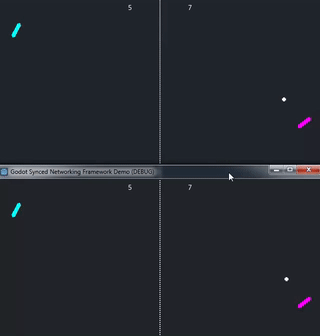

Godot Synced
============

Synced is a high-level networking framework for Godot game engine. It provides tools and design patterns
to facilitate making fast-paced multiplayer games with authoritative server architecture.

Synced is designed to be easy to grasp. It hides from game logic code most complexities inherent to networking.
In most cases you should code your game objects as if you were making a single player game.

TODO: apologize for a very early dev stage and all the bugs and TODOs ;)

Getting started: working example
--------------------------------

If you clone this repo, it contains a project with a game of Pong, re-implemented with Synced.

Unremarkable unless you know what it tries to do.

  * One game instance is an **authoritative Server** in full control of game state.
    Server simulates game world at 60 (actually, `Engine.iterations_per_second`) ticks per second.
  * Another instance is a Client. Client **sends keyboard and mouse input** to Server 30 times per second
    and receives object positions and the rest of game state from Server 20 times per second.
  * Client smoothly **interpolates** game object positions between network frames, rendering game at 60+ FPS.
    Interpolation makes slow network sendrate imperceptible. Limiting network sendrate **optimizes traffic usage**.
  * Client implements **client-side prediction** mechanisms. This hides network round-trip to server,
    making player-controlled paddle react immediately to keypress and mouse movement.
  * Client implements **lag-compensation** mechanisms. Client's interaction with the ball happens exactly where Client
    sees the ball, hiding the fact that Server might see the ball elsewhere when Client's input finally comes to Server.
  * All this in barely more code than Godot's original demo of Pong. In particular, same code works for server-side
    simulation and for client-side prediction. **No code duplication.**

Getting started: add to existing game
-------------------------------------

1. Copy addons/synced to the same dir in your project.

2. Add `res://addons/synced/SyncManager.gd` as a singleton.

3. Attach a [Synced](godot-synced/addons/synced/Synced.gd) node as a child to all active game objects
   (Node2D or Spatial) that need to be synced over the network between peers. This will make the Server send
   their positions and rotations to all Clients 20 times per second, with smooth interpolation between frames.
   See Pong example game.

4. Set up client-server connection as you would normally do via built-in Godot networking.
   See [lobby script](playground/pong/logic/lobby.gd) as an example.

5. Assign different `Synced` nodes you added in (3) to belong to different players. This has to be done for all players
   connected. Each player usually has one game object that represents player's avatar. Set `Synced.belongs_to_peer_id`
   to 0 for local player on both Clients and Server; and to peer_id from Godot's `NetworkedMultiplayerPeer` on Server.
   See [pong script](playground/pong/logic/pong.gd) as an example.

6. Instead of Godot's built-in `Input` class, you have to use `$synced.input` to read player input.
   `$synced` here means `Synced` object from (3) above that is a child of game object in question,
   and `$synced.input` is a (limited) drop-in replacement for Godot's Input class.
   See [paddle script](playground/pong/logic/paddle.gd) as an example.

This should launch and sync as long as Clients and Server have the same NodePaths for all objects. All synced
game objects will have their positions synced via network and interpolated between network frames.

In-depth topics
---------------

To sync any property on your game objects, not just their positions, add `SyncedProperty` children to `Synced` object.
This also allows to customize how sync and interpolation should be done. See how Ball is set up to sync
direction of movement and speed, and Pong scene to sync score.

TODO: describe how to set up more nice things, how they work and why use them: authoritative server archetecture;
interpolation; client-side prediction; lag compensation.

TODO: add more complex examples: how to spawn and sync dynamic game objects; animation sync; tweak traffic footprint.

Class docs
----------

Nothing to show here yet, WIP. Consider reading code comments inside `addons/synced`. TODO.

Contacts
--------

I will probably launch a Discord server eventually. Until then, reach me via `WhiteVirus#2531` on Discord.

License
-------

Copyright 2021-2022 Leonid Vakulenko.

Licensed under the [MIT License](LICENSE.txt).
